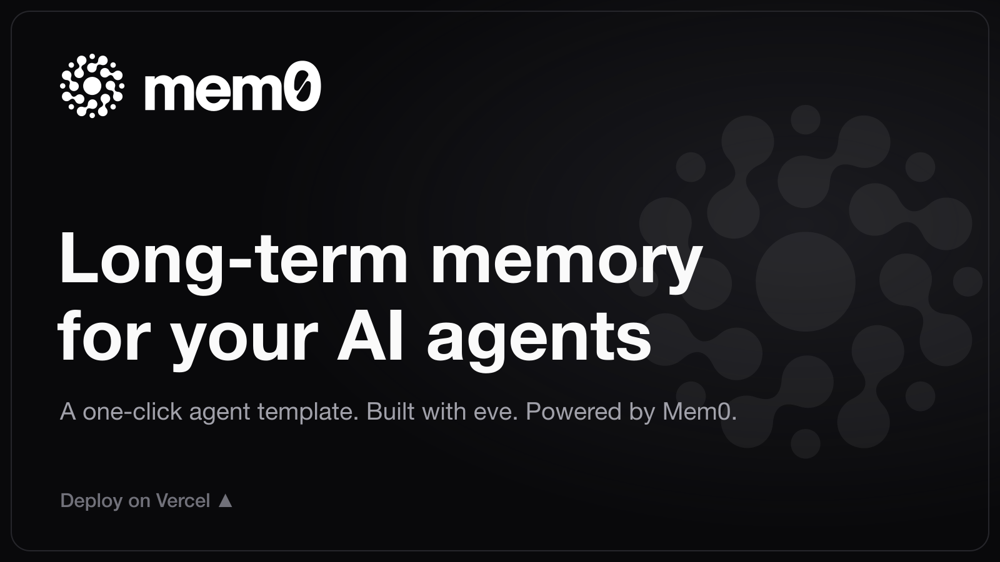

# Mem0 eve template

A one-click deployable AI chat agent with long-term memory, built with
[eve](https://eve.dev) (Vercel's framework for durable backend AI agents) and
powered by [Mem0](https://mem0.ai). It ships a web chat UI and remembers facts
about each user across conversations, so it gets more helpful over time instead
of starting from scratch.

## Deploy

[](https://vercel.com/new/clone?repository-url=https%3A%2F%2Fgithub.com%2Fmem0ai%2Feve-mem0-template&project-name=eve-mem0-template&repository-name=eve-mem0-template&products=%5B%7B%22type%22%3A%22integration%22%2C%22integrationSlug%22%3A%22mem0%22%2C%22productSlug%22%3A%22mem0%22%2C%22protocol%22%3A%22storage%22%7D%5D)

Deploy clones this repo and installs the Mem0 integration, which provisions a
scoped Mem0 project and injects `MEM0_API_KEY`, `MEM0_ORG_ID`, `MEM0_PROJECT_ID`,
and `MEM0_BASE_URL` into your project. Model access uses the Vercel AI Gateway.

## What you get

- A **web chat UI** (Next.js) served at `/`.
- Two Mem0-backed tools:
  - **`remember`** — saves a durable fact or preference (`mem0.add`).
  - **`recall_memories`** — searches long-term memory for relevant facts (`mem0.search`).

The instructions (`agent/instructions.md`) tell the model to recall before
answering and to remember durable facts. Memory is scoped per user via
`ctx.session.auth.current.principalId` (see `agent/lib/mem0.ts`).

## Auth (important)

The chat channel (`agent/channels/eve.ts`) ships with `placeholderAuth()`, the
**safe default**: local development works, your own Vercel deployments and the
eve TUI can reach the agent, and anonymous browser traffic is **blocked in
production**. So a fresh deploy does not expose an open, spend-able endpoint.

To open the chat to users, add an auth provider (Auth.js, Clerk, `vercelOidc()`).
Memory is scoped per authenticated user via `principalId`, so each user gets
their own private memory automatically. For a throwaway public demo where
everyone shares one memory, swap `placeholderAuth()` for `none()`.

## Run locally

```bash
npm install
cp .env.example .env    # add MEM0_API_KEY and model access (AI_GATEWAY_API_KEY)
npm run dev             # Next.js dev server with the chat UI
```

Try it: tell the agent something ("I'm vegetarian and allergic to peanuts"),
start a new chat, and ask "what can I cook for dinner?" — it recalls what you
told it.

## Learn more

- [Mem0 on Vercel](https://docs.mem0.ai/integrations/vercel)
- [Mem0 quickstart](https://docs.mem0.ai/platform/quickstart)
- [eve documentation](https://eve.dev/docs)

## Contributing

Improvements to the template are welcome. See [CONTRIBUTING.md](./CONTRIBUTING.md).

## License

Apache-2.0. See [LICENSE](./LICENSE).
